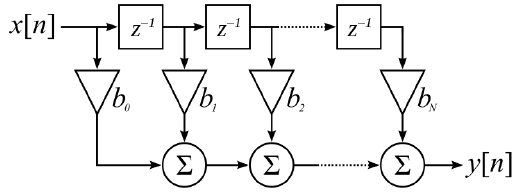

# FIR_filter_in_SystemC - vincent08tw
###### tags: `SystemC` `C++` `C`

## Project Description
Use SystemC to implement a 16th-order discrete-time Finite Impulse Response (FIR) digital filter, in 200MHz clock.

* Environment
	* SystemC 2.3.3
	* Ubuntu 18.04

* Specification  
	* A schematic of N-th order discrete time FIR filter  
		  
```
The 16th-order FIR module with a SC_CTHREAD process
1. Use above schematic as the specification and implement a non-pipeline 16th-order FIR filter, in SC_MODULE with a SC_CTHREAD process.
2. The input port is named x and its data type is sc_uint<32>.
3. The output port is named y and its data type is sc_uint<32>.
4. The positive triggering clock port is named clk. The synchronous active-low reset pin is named rst.
5. Let us do a Moving Average Filter, a.k.a. boxcar filter, where all bi = 1/(N + 1). Therefore, in this case bi = 1/17 ≈ 0.05882353.
6. Let us use a fixed point system of wl=32 and iwl=16 for all computations. Then bi = 0x00000F0F
7. The reset behavior is to reset all delays to 0.
8. name file as FIR16.h and FIR16.cpp.

sc_main
1. Instantiate the FIR16 modules
2. Read 64 input data, one-by-one and feed into the x port of the FIR16, from a file named “firData.”
3. Create a trace file named RESULT.vcd. And trace ports are shown in the following order:
	clk
	rst
	x
	y
```

## Project directory hierachy
```
HAdder_FAdder_in_SystemC/
    +-- src/
    |   +-- FIR16.cpp
    |   +-- FIR16.h
    |   +-- fiData
    |   +-- generate_file.cpp
    |   +-- generate_file.exe
    |   +-- generate_file.h
    |   +-- main.cpp
    |   +-- Makefile
    |
    +-- img/
    |   Schematic_of_Nth_order_discrete_time_FIR_filter.PNG
    |
    README.md
```


